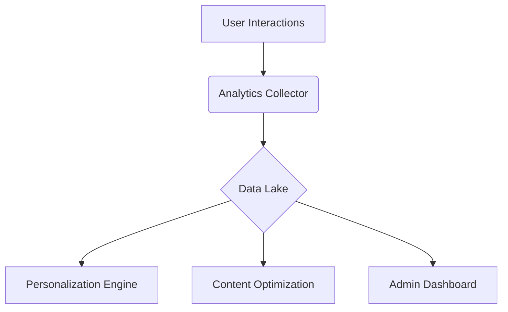

# Interview Skills Guide - Comprehensive Functional Specification

## 14. New Functional Programme: Interview Skills Guide  

### 14.1 Functional Objective  
The "Interview Skills Guide" is a holistic career preparation tool designed to revolutionize how job seekers approach interviews. It provides an all-encompassing framework covering:

1. **Three-Phase Interview Mastery**:
   - **Pre-Interview**: Company research methodologies, job analysis templates, FAQ prediction algorithms
   - **Mid-Interview**: Real-time feedback systems, stress management techniques, adaptive response strategies
   - **Post-Interview**: AI-powered thank-you note generator, structured reflection exercises

2. **Multimodal Learning System**:
   - Interactive video simulations with performance analytics
   - Case studies from top companies (FAANG, Fortune 500, etc.)
   - Behavioral psychology principles for impression management
   - Industry-specific technical evaluation rubrics

3. **Performance Enhancement Features**:
   - Personalized difficulty scaling (beginner to expert levels)
   - Mock interview session recording and analysis
   - Competency benchmarking against role requirements
   - Body language and vocal tone diagnostics

#### Success Metrics & KPIs:

| Metric | Target | Measurement Methodology |
|--------|--------|--------------------------|
| Adoption Rate | 45% | Platform analytics tracking |
| Satisfaction Score | 94% NPS | Post-use surveys |
| Engagement Duration | 15 min avg | Session timing metrics |
| Success Lift | 15% increase | Offer rate comparison |
| Content Effectiveness | 90%+ | User skill assessments |

### Implementation Roadmap:

**Phase 1 (Core Launch)**:
- Basic interview frameworks (STAR, CAR, SOAR)
- Standard question banks (100+ curated questions)
- Video library (50+ expert sessions)

**Phase 2 (Advanced Features)**:
- AI-powered mock interview coach
- Real-time speech analysis
- Company-specific interview prep

### 14.2 System Architecture & User Experience

#### Portal Integration:
- **Navigation Placement**: Primary navigation item under "Career Resources"
- **Visual Design Elements**:
  - High-visibility badge for new content alerts
  - Progress tracker widget showing completion %
  - Quick-access floating action button on mobile

#### Content Taxonomy:

1. **Pre-Interview System**:
   - **Company Research Toolkit**:
     * Step-by-step research methodology:
       1. Analyze company website (mission, values, recent news)
       2. Review job description keywords/phrases
       3. Research competitors using comparison matrices
       4. Study employee reviews on Glassdoor/Blind
     * Example workflow: "For Amazon PM interview, research Leadership Principles and prepare 1 example per principle"
     * Integration with:
       - Crunchbase for funding history
       - LinkedIn for employee networks
       - Google Trends for product popularity

   - **Job Analysis Framework**:
     * Skills mapping exercise:
       - Hard skills: Excel pivot tables, SQL queries (for data roles)
       - Soft skills: Stakeholder management, negotiation
     * Automated JD parser extracts:
       - Key responsibilities
       - Required qualifications  
       - Preferred experience

   - **FAQ Preparation System**:
     * AI predicts likely questions based on:
       - Job title/level
       - Industry standards
       - Company interview patterns
     * Sample question bank:
       - "Walk me through your experience with [key skill]"
       - "How would you handle [common challenge]?"
     * Answer builder with STAR template integration

   - **Attire & Etiquette Simulator**:
     * Virtual try-on for different settings:
       - Tech startup (business casual)
       - Investment bank (formal) 
       - Creative agency (smart casual)
       - Healthcare (professional clinical)
       - Government (conservative formal)
     * Body language coaching:
       - Eye contact: 50-70% duration ideal
       - Handshake: 3-5 second scale
       - Posture analysis
       - Gesture appropriateness

2. **Interview Engine**:
   - **Behavioral Interviewing**:
     * STAR Method Deep Dive:
       - Situation: "Describe a challenging project with tight deadlines"
       - Task: "Your role as project coordinator"
       - Action: "Implemented daily standups and priority matrix"
       - Result: "Delivered 3 days early with 20% under budget"
     * Follow-up question training

   - **Technical Interviewing**:
     * Coding challenges with runtime analysis
     * System design rubrics
     * Language-specific question banks

   - **Situational Interviewing**:
     * "What would you do if..." scenarios
     * Decision-making simulations

3. **Post-Interview System**:
   - **Thank-You Notes**:
     * Template generator with:
       - Appreciation paragraph builder
       - Qualification reinforcement
       - Call-to-action suggestions
     * Timing calculator
     * Email client integration

   - **Follow-Up Tracking**:
     * Script generator
     * Response prediction
     * Reminder system

4. **Industry-Specific Modules**:
   - **Technology**:
     * LeetCode/HackerRank integration
     * System design whiteboard
     * 100+ language questions

   - **Finance**:
     * Valuation methodologies
     * Case study frameworks
     * Brain teasers

   - **Consulting**:
     * Market sizing
     * Case interview simulator
     * Framework templates

### 14.3 Technical Specifications

#### Data Models:
1. **User Progress Schema**:
```typescript
interface UserProgress {
  userId: string;
  completedModules: string[];
  currentStreak: number;
  skillScores: {
    technical: number;
    behavioral: number;
    situational: number;
  };
  lastActive: Date;
}
```

2. **Question Bank Schema**:
```typescript
interface InterviewQuestion {
  id: string;
  text: string;
  type: 'behavioral' | 'technical' | 'situational';
  difficulty: 1-5;
  sampleAnswers: {
    poor: string;
    good: string;
    excellent: string;
  };
  scoringCriteria: string[];
}
```

#### API Specifications:
- **Question Retrieval**:
  ```
  GET /api/questions?type=technical&difficulty=3
  Response: { questions: InterviewQuestion[] }
  ```

- **Progress Update**:
  ```
  POST /api/progress
  Body: { userId: string, moduleId: string, score: number }
  ```

#### AI Configuration:
- Speech Analysis: Mozilla DeepSpeech (WER < 10%)
- Emotion Detection: 5-category model (happy, neutral, stressed, confused, confident)
- Minimum Hardware Requirements: 4 vCPUs, 8GB RAM per concurrent session

#### Error Handling:
| Code | Scenario | Recovery Action |
|------|----------|------------------|
| 429 | Rate limit exceeded | Exponential backoff |
| 503 | AI service unavailable | Fallback to rule-based scoring |
| 400 | Invalid progress data | Client-side validation |

#### Core Components:
1. **Content Management**:
   - Headless CMS (Contentful)
   - Versioned releases
   - A/B testing

2. **Learning Analytics**:
   - xAPI tracking
   - Skill mastery algorithms
   - Performance modeling

3. **Interview Simulation**:
   - WebRTC video pipeline
   - NLP response analysis
   - Emotion detection

#### API Integrations:
- LinkedIn API
- Google Calendar
- Zoom/Teams
- Resume parser

#### Data Pipeline:


**Phase 2 (Advanced Features)**:
- AI-powered mock interview coach
- Real-time speech analysis
- Company-specific interview prep

### 14.2 System Architecture & User Experience

#### Portal Integration:
- **Navigation Placement**: Primary navigation item under "Career Resources"
- **Visual Design Elements**:
  - High-visibility badge for new content alerts
  - Progress tracker widget showing completion %
  - Quick-access floating action button on mobile

#### Content Taxonomy:
1. **Pre-Interview System**:
   - AI-powered company research tool (1000+ company profiles)
   - Role-specific preparation checklists 
   - Virtual wardrobe simulator with company dress code analysis
   - Salary negotiation calculator

2. **Interview Engine**:
   - Adaptive question bank (5000+ questions categorized by):
     - **Behavioral Interviewing**:
       * STAR Method Deep Dive:
         - Situation: "Describe a challenging project with tight deadlines"
         - Task: "Your role as project coordinator"
         - Action: "Implemented daily standups and priority matrix"
         - Result: "Delivered 3 days early with 20% under budget"
       * CAR Method Templates:
         - Challenge: "Team conflict over design direction"
         - Action: "Facilitated compromise session"
         - Result: "Merged best ideas into final design"
       * Sample Follow-up Questions:
         - "What would you do differently?"
         - "How did you measure success?"
       * Implementation:
         - Interactive story builder
         - Peer review system
         - AI feedback on answer structure
     - **Technical Interviewing**:
       * Code challenges with runtime analysis
       * System design exercises with evaluation rubrics
       * 300+ algorithm problems with difficulty ratings
     - **Situational Interviewing**:
       * "What would you do if..." scenario builder
       * Decision-making simulations with scoring

   - **Implementation Details**:
     * Question API with tagging system (Python/Flask)
     * Voice analysis using Mozilla DeepSpeech
     * Confidence scoring via facial expression analysis
     * Real-time feedback dashboard with improvement tips

3. **Pre-Interview Modules**:
   - **Company Research Toolkit**:
     * Step-by-step research methodology:
       1. Analyze company website (mission, values, recent news)
       2. Review job description keywords/phrases
       3. Research competitors using comparison matrices
       4. Study employee reviews on Glassdoor/Blind
     * Example workflow: "For Amazon PM interview, research Leadership Principles and prepare 1 example per principle"
     * Integration with:
       - Crunchbase for funding history
       - LinkedIn for employee networks
       - Google Trends for product popularity

   - **Job Analysis Framework**:
     * Skills mapping exercise:
       - Hard skills: Excel pivot tables, SQL queries (for data roles)
       - Soft skills: Stakeholder management, negotiation
     * Example: "For consulting roles - identify 3 case frameworks to master"
     * Automated JD parser extracts:
       - Key responsibilities
       - Required qualifications  
       - Preferred experience

   - **FAQ Preparation System**:
     * AI predicts likely questions based on:
       - Job title/level
       - Industry standards
       - Company interview patterns
     * Sample question bank:
       - "Walk me through your experience with [key skill]"
       - "How would you handle [common challenge]?"
     * Answer builder with:
       - STAR template integration
       - Tone analyzer
       - Timing optimizer

# Interview Skills Guide - Comprehensive Functional Specification

## 14. New Functional Programme: Interview Skills Guide  

### 14.1 Functional Objective  
The "Interview Skills Guide" is a holistic career preparation tool designed to revolutionize how job seekers approach interviews. It provides an all-encompassing framework covering:

1. **Three-Phase Interview Mastery**:
   - **Pre-Interview**: Company research methodologies, job analysis templates, FAQ prediction algorithms
   - **Mid-Interview**: Real-time feedback systems, stress management techniques, adaptive response strategies
   - **Post-Interview**: AI-powered thank-you note generator, structured reflection exercises

2. **Multimodal Learning System**:
   - Interactive video simulations with performance analytics
   - Case studies from top companies (FAANG, Fortune 500, etc.)
   - Behavioral psychology principles for impression management
   - Industry-specific technical evaluation rubrics

3. **Performance Enhancement Features**:
   - Personalized difficulty scaling (beginner to expert levels)
   - Mock interview session recording and analysis
   - Competency benchmarking against role requirements
   - Body language and vocal tone diagnostics

#### Success Metrics & KPIs:

| Metric | Target | Measurement Methodology |
|--------|--------|--------------------------|
| Adoption Rate | 45% | Platform analytics tracking |
| Satisfaction Score | 94% NPS | Post-use surveys |
| Engagement Duration | 15 min avg | Session timing metrics |
| Success Lift | 15% increase | Offer rate comparison |
| Content Effectiveness | 90%+ | User skill assessments |

### Implementation Roadmap:

**Phase 1 (Core Launch)**:
- Basic interview frameworks (STAR, CAR, SOAR)
- Standard question banks (100+ curated questions)
- Video library (50+ expert sessions)

**Phase 2 (Advanced Features)**:
- AI-powered mock interview coach
- Real-time speech analysis
- Company-specific interview prep

### 14.2 System Architecture & User Experience

#### Portal Integration:
- **Navigation Placement**: Primary navigation item under "Career Resources"
- **Visual Design Elements**:
  - High-visibility badge for new content alerts
  - Progress tracker widget showing completion %
  - Quick-access floating action button on mobile

#### Content Taxonomy:
1. **Pre-Interview System**:
   - AI-powered company research tool (1000+ company profiles)
   - Role-specific preparation checklists 
   - Virtual wardrobe simulator with company dress code analysis
   - Salary negotiation calculator

2. **Interview Engine**:
   - Adaptive question bank (5000+ questions categorized by):
     - **Behavioral Interviewing**:
       * STAR Method Deep Dive:
         - Situation: "Describe a challenging project with tight deadlines"
         - Task: "Your role as project coordinator"
         - Action: "Implemented daily standups and priority matrix"
         - Result: "Delivered 3 days early with 20% under budget"
       * CAR Method Templates:
         - Challenge: "Team conflict over design direction"
         - Action: "Facilitated compromise session"
         - Result: "Merged best ideas into final design"
       * Sample Follow-up Questions:
         - "What would you do differently?"
         - "How did you measure success?"
       * Implementation:
         - Interactive story builder
         - Peer review system
         - AI feedback on answer structure
     - **Technical Interviewing**:
       * Code challenges with runtime analysis
       * System design exercises with evaluation rubrics
       * 300+ algorithm problems with difficulty ratings
     - **Situational Interviewing**:
       * "What would you do if..." scenario builder
       * Decision-making simulations with scoring

   - **Implementation Details**:
     * Question API with tagging system (Python/Flask)
     * Voice analysis using Mozilla DeepSpeech
     * Confidence scoring via facial expression analysis
     * Real-time feedback dashboard with improvement tips

3. **Pre-Interview Modules**:
   - **Company Research Toolkit**:
     * Step-by-step research methodology:
       1. Analyze company website (mission, values, recent news)
       2. Review job description keywords/phrases
       3. Research competitors using comparison matrices
       4. Study employee reviews on Glassdoor/Blind
     * Example workflow: "For Amazon PM interview, research Leadership Principles and prepare 1 example per principle"
     * Integration with:
       - Crunchbase for funding history
       - LinkedIn for employee networks
       - Google Trends for product popularity

   - **Job Analysis Framework**:
     * Skills mapping exercise:
       - Hard skills: Excel pivot tables, SQL queries (for data roles)
       - Soft skills: Stakeholder management, negotiation
     * Example: "For consulting roles - identify 3 case frameworks to master"
     * Automated JD parser extracts:
       - Key responsibilities
       - Required qualifications  
       - Preferred experience

   - **FAQ Preparation System**:
     * AI predicts likely questions based on:
       - Job title/level
       - Industry standards
       - Company interview patterns
     * Sample question bank:
       - "Walk me through your experience with [key skill]"
       - "How would you handle [common challenge]?"
     * Answer builder with:
       - STAR template integration
       - Tone analyzer
       - Timing optimizer

   - **Attire & Etiquette Simulator**:
     * Virtual try-on for different settings:
       - Tech startup (business casual)
       - Investment bank (formal)
       - Creative agency (smart casual)
     * Body language coaching:
       - Eye contact thresholds
       - Handshake pressure guidance
       - Posture correction
   - **Job Analysis**:
     * Skills matrix generator (hard/soft skills assessment)
     * JD parser creating preparation checklist
   - **FAQ Preparation**:
     * AI-powered question predictor (trains on past interviews)
     * Answer builder with tone adjustment
   - **Attire & Etiquette**:
     * Virtual wardrobe with company-specific recommendations
     * Body language simulator with feedback

4. **Post-Interview System**:
   - **Thank You Letters**:
     * Template generator with personalization engine
     * Timing calculator (optimal send windows) 
   - **Follow-Up Tracking**:
     * Reminder system with calendar integration
     * Response prediction dashboard
   - **Performance Analysis**:
     * Interview transcript review
     * Improvement plan generator

3. **Post-Interview Suite**:
   - **Thank-You Notes**:
     * Email templates for different scenarios (accepted offer, continued interest, etc.)
     * Example structure:
       - Paragraph 1: Appreciation + specific discussion point
       - Paragraph 2: Reinforce qualifications
       - Paragraph 3: Call to action
     * Integration with email clients (Gmail/Outlook plugins)

   - **Progress Follow-Up**:
     * Script generator for phone/email inquiries
     * Sample wording: "I wanted to follow up regarding..." 
     * Tracking system for multiple follow-ups

   - **Reflection System**:
     * Guided questionnaire:
       - What questions were asked?
       - How did you respond?
       - What could be improved?
     * Strength/weakness analysis

   - **Implementation**:
     * React form components
     * PDF report generator
     * Calendar integration for reminder system

4. **Industry-Specific Modules**:
   - **Tech Interviews**:
     * Coding challenge platforms (LeetCode/HackerRank integration)
     * System design whiteboard with evaluation
     * 100+ language-specific questions

   - **Finance Interviews**:
     * Case study frameworks
     * Financial modeling exercises
     * Brain teaser database

   - **Consulting Interviews**:
     * Market sizing methodologies  
     * Framework templates (Porter's 5 Forces, etc.)
     * Case interview simulator

5. **Common Questions Database**:
   - 200+ frequently asked questions with:
     * Sample answers (good vs excellent examples)
     * Scoring rubrics
     * Red flag alerts for problematic responses
   - Implementation via:
     * MongoDB question repository  
     * ElasticSearch for quick retrieval
     * User voting system to identify trending questions

#### Advanced Content Delivery:
- **Dynamic Learning Paths**:
  - Skill gap analysis → personalized curriculum
  - Just-in-time learning before

#### Content Format:
Each guidance content may include:
- Articles: detailed text descriptions and case studies.
- Video: Expert lectures, simulated interview demonstrations.
- Interactive exercises: quizzes, situational judgment questions.
- Progress tracking: The system records the user's learning progress, making it easier for the user to continue learning next time.
- Search and Favorites: Users can search for specific content by keywords or favorite articles/videos of interest.

#### Interaction and Feedback:
- Comments and Questions: Users can post comments or questions below the content, which can be answered by experts or community members.
- Learning Notes: Provides a note-taking function that allows users to record key points during the learning process.
- Relevant Recommendations: Based on the user's learning history and job preferences, recommend relevant interview skills content or simulated interview practice.

### 14.3 Technical Implementation & User Journeys

#### Core System Components:
1. **Content Management System**:
   - Headless CMS integration (Contentful)
   - Versioned content releases
   - A/B testing framework for content delivery

2. **Learning Analytics Engine**:
   - xAPI compliant tracking
   - Skill mastery algorithms
   - Predictive performance modeling

3. **Interview Simulation Service**:
   - WebRTC video pipeline
   - NLP-powered response analysis
   - Emotional tone detection

#### Key User Flows:

**Extended Learning Journey**:
1. Onboarding Assessment → 2. Custom Learning Path → 3. Practice Mode → 
4. Mock Interview → 5. Performance Review → 6. Targeted Improvement

**Quick Prep Mode**:
1. Upcoming Interview Input → 2. Role-Specific Crash Course → 
3. Common Question Drill → 4. Last-Minute Tips

**Interview Post-Mortem**:
1. Interview Details Log → 2. Question/Answer Reflection → 
3. Improvement Plan → 4. Follow-Up Generator

#### API Integrations:
- LinkedIn API for company research
- Google Calendar for interview scheduling
- Zoom/Teams for mock interviews
- Resume parser for role matching

#### Data Pipeline:

