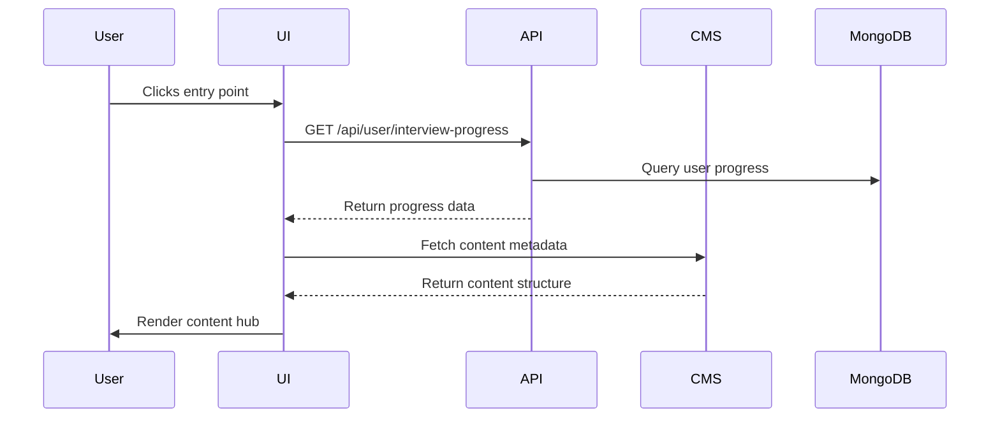

# 14. New Feature: Interview Skills Guide - Technical Specifications

## 14.1 Feature Objectives & Technical Scope
## Technical Overview
The Interview Skills Guide will be implemented as a Next.js module integrated with our existing career dashboard. Key technical components:

- **Content Management**: Leveraging Sanity.io CMS for articles/videos
- **User Progress Tracking**: MongoDB collection `userInterviewProgress`
- **Recommendation Engine**: AI-based using user's job preferences/interaction history
- **Analytics**: Mixpanel events for tracking engagement metrics

## Implementation Phases
1. Phase 1 (2 weeks): Core content framework
2. Phase 2 (1 week): Progress tracking
3. Phase 3 (1 week): Recommendation engine
4. Phase 4 (1 week): Analytics integration

## Core Objectives
The feature provides comprehensive interview preparation through multiple media formats, with these technical objectives:

1. Provide systematic interview guidance: Covering all aspects of interview preparation, from basic knowledge to advanced techniques.
2. Boost interview confidence: Through learning and practice, help users appear more confident and professional in interviews.
3. Increase interview success rate: Master effective techniques to improve chances of receiving offers.

### Key Metrics & Tracking:
| Metric | Tracking Method | Target |
|--------|-----------------|--------|
| Active Users | Mixpanel event `interview_guide_accessed` | 40% of job seekers |
| Content Satisfaction | In-app survey (5-star scale) | ≥4.6 avg rating |
| Session Duration | Mixpanel session timing | ≥10 mins |
| Success Rate Improvement | User cohort analysis | +10% for mock users |

**Technical Implementation:**
- All metrics tracked via dedicated Mixpanel events
- Survey results stored in `userFeedback` collection
- Success rate calculated via follow-up job application tracking

## 14.2 Interaction & Technical Implementation Details

### UI Components Library Reference:
All components will use our existing DaisyUI/Tailwind design system:
- `Card`: TW classes `card bg-base-100 shadow-xl`
- `Accordion`: DaisyUI `collapse` component
- Progress tracker: Custom component using `progress` class

### Entry Points & Technical Flow:
1. **Homepage Entry**: 
   - Location: `/career-dashboard` sidebar under "Learning Resources"
   - Component: `InterviewGuideEntryPoint` 
   - Props: `userIndustry`, `lastAccessed` 
   - API: GET `/api/user/interview-progress`
2. **Content Hub Technical Spec**:
| Category | Component | Data Source | API Endpoint |
|----------|-----------|-------------|--------------|
| Pre-interview | `InterviewPrepSection` | Sanity GROQ query | `/api/content/interview-prep` |
| Techniques | `VideoTutorialGrid` | Vimeo API | `/api/vimeo/interview-videos` |
| Post-interview | `ChecklistForm` | Custom form | POST `/api/user/followups` |

**Technical Requirements:**
- Lazy loading for video content
- Client-side caching for articles
- User interaction analytics for each content type
   - **Pre-interview Prep**: Company research, position analysis, common question preparation, dress code/etiquette.
   - **Interview Techniques**: Behavioral interviews, technical interviews, situational interviews, STAR method, questioning techniques, body language.
   - **Post-interview Follow-up**: Thank you letters, progress inquiries, self-reflection and summary.
   - **Industry-specific Interview Characteristics**: Interview techniques tailored to different industries (IT, finance, marketing, etc.).
   - **Common Interview Questions**: Sample answers and analysis for frequently asked interview questions.

3. **Content Formats**: Each guidance content may include:
   - Articles: Detailed explanations and case studies.
   - Videos: Expert explanations, mock interview demonstrations.
   - Interactive Exercises: Quizzes, situational judgment tests.

4. **Progress Tracking**: System records user learning progress for easy continuation.
5. **Search & Bookmark**: Users can search content by keywords or bookmark interesting articles/videos.

### Interaction & Feedback:
- Comments & Questions: Users can post comments/questions under content, answered by experts or community members.
- Study Notes: Provides note-taking functionality for users to record key points while learning.
- Recommended Content: System recommends relevant interview skills content or mock interview exercises based on user learning history and job preferences.

## 14.3 Technical Implementation Flow

### 1. Feature Entry Sequence:

### 2. Content Delivery Flow:

2. Browsing & learning content:
   - User browses guidance content by category, selecting articles, videos or interactive exercises.
   - System records user learning progress.

3. Interaction & feedback:
   - User can comment, ask questions, or take notes on content.
   - System recommends related content based on user learning behavior.

4. Application & improvement:
   - User applies learned techniques in mock or real interviews.
   - System monitors user interview performance data and optimizes subsequent guidance.
