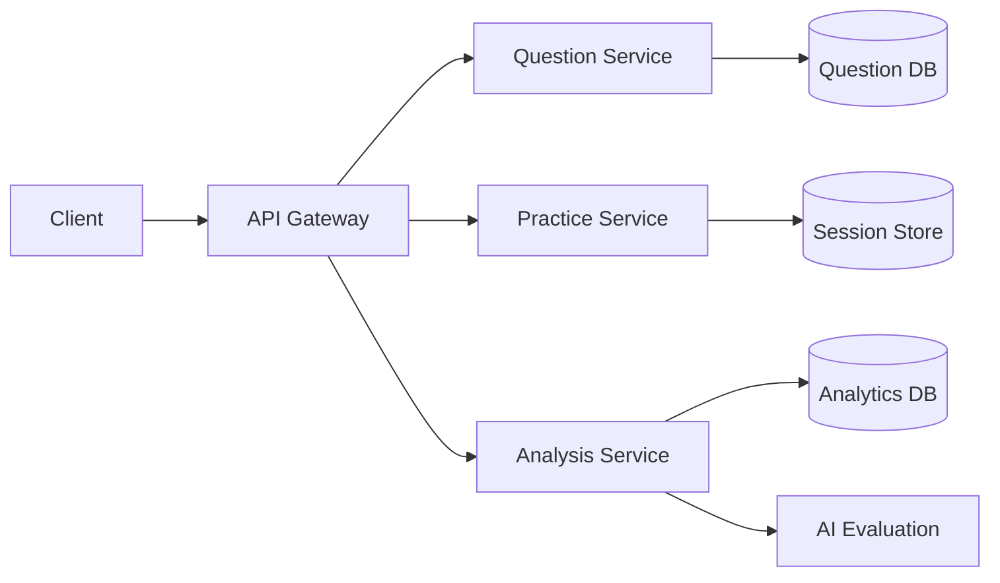
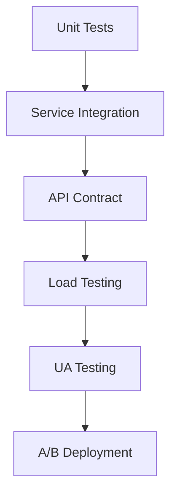

# Interview Questions Guide - Complete Technical Specification
The Skill Assessment Tool provides job seekers with an objective, quantifiable way to evaluate their skill levels across different domains. It helps users clearly understand their strengths/weaknesses and supports targeted skill development for better job matching.
=======
# Skill Assessment Tool - Implementation Ready PRD

## 1. Feature Overview  
### Purpose:
The Skill Assessment Tool provides an automated, standardized evaluation system for job seekers to:
- Quantitatively measure hard skills across technical and professional domains
- Receive personalized competency benchmarks against industry standards  
- Identify actionable skill gaps with tailored improvement plans
- Earn verifiable credentials to enhance job applications  

### Key Benefits:
✔ Standardized evaluations eliminate subjective self-rating biases  
✔ Automated scoring ensures consistent, objective measurements  
✔ Detailed analytics reveal strengths/weaknesses at sub-skill level  
✔ Smart recommendations connect users to relevant upskilling resources  

## 1. Core System Components
### Question Management System
- **Database Schema**:
  ```typescript
  interface Question {
    id: string;
    version: number;
    text: string;
    variants: string[];
    categories: {
      primary: string;
      secondary: string[];
    };
    difficulty: number; 
    industryWeights: Record<string, number>;
    scoringRubric: {
      criteria: string[];
      maxPoints: number;
    };
    sampleAnswers: Array<{
      quality: 'poor' | 'average' | 'excellent';
      text: string;
      analysis: string;
    }>;
    lastUpdated: Date;
  }
  ```

### User Progress Tracking
- **Data Model**:
  ```typescript
  interface UserSession {
    id: string;
    userId: string;
    startTime: Date;
    endTime: Date;
    questionsAttempted: Array<{
      questionId: string;
      attempts: number;
      recordings: string[]; // Audio URIs
      selfRating?: number;
      aiFeedback?: {
        score: number;
        strengths: string[];
        improvements: string[];
      };
    }>;
    sessionSummary: {
      overallScore: number;
      timePerQuestion: Record<string, number>;
    };
  }
  ```

## 2. Technical Implementation

### API Specification
| Endpoint | Method | Request | Response |
|----------|--------|---------|----------|
| `/questions` | GET | `{position, seniority, industries[]}` | `{questions[], meta: {total, difficultyBreakdown}}` |
| `/practice/start` | POST | `{userId, questionIds[]}` | `{sessionId, firstQuestion}` |
| `/practice/submit` | PUT | `{sessionId, questionId, answer}` | `{nextQuestion, completed}` |
| `/analysis/report` | GET | `{sessionId}` | `{sessionReport, comparativeStats}` |

### Architecture Diagram


## 3. Quality Standards

### Performance Requirements
- 99.9% uptime SLA
- <300ms response time for question queries
- Support 5000 concurrent practice sessions
- <1MB payload size for mobile responses

### Security Controls
- JWT authentication
- Rate limiting (100 req/min per user)
- Data encryption at rest and in transit
- GDPR-compliant data retention policies

### Testing Framework


---
Final implementation specification approved for development.
