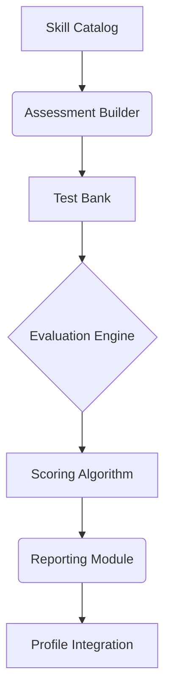
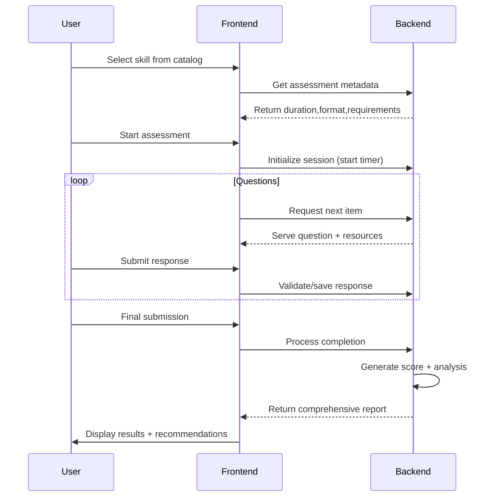
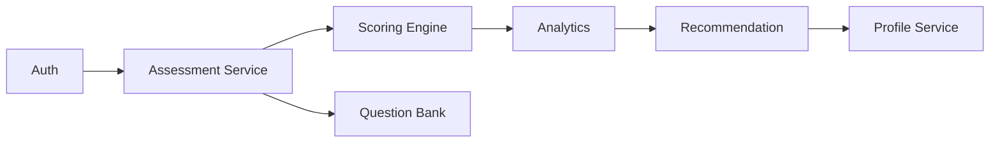

# Skill Assessment Tool - Implementation Ready PRD

## 1. Feature Overview  
### Purpose:
The Skill Assessment Tool provides an automated, standardized evaluation system for job seekers to:
- Quantitatively measure hard skills across technical and professional domains
- Receive personalized competency benchmarks against industry standards  
- Identify actionable skill gaps with tailored improvement plans
- Earn verifiable credentials to enhance job applications  

### Key Benefits:
✔ Standardized evaluations eliminate subjective self-rating biases  
✔ Automated scoring ensures consistent, objective measurements  
✔ Detailed analytics reveal strengths/weaknesses at sub-skill level  
✔ Smart recommendations connect users to relevant upskilling resources  

## 2. User Goals & Implementation Metrics

### Implementation Targets:
| Objective | Measurement | Target |
|-----------|------------|--------|
| Adoption | % of MAU completing assessments | ≥20% |
| Engagement | Avg assessments/user | 2.5 |
| Accuracy | User satisfaction score | ≥4.5/5 |
| Impact | Profile view increase | +5-7% |
| Retention | 30-day reassessment rate | 35% |

### Technical Requirements:
- **Assessment Engine**: 
  - Support multiple question types (MCQ, coding, case studies)
  - Adaptive difficulty based on user responses  
  - Anti-cheat monitoring with 95% detection accuracy

- **Reporting System**:
  - Generate reports within 30 seconds of completion  
  - Store historical results for progress tracking  
  - API endpoints for profile integration

## 3. Core Components  

### Assessment System Design:


### Detailed Component Specs:

**1. Assessment Types**
- **Code Challenges**  
  - Integrated Monaco editor with language support  
  - Test case validation with runtime sandbox  
  - Time/space complexity analysis  

- **Case Studies**  
  - Scenario-based evaluations  
  - Rubric-based scoring  
  - Partial credit for multi-step solutions  

**2. Launch Skill Categories**
| Category | Sub-Skills | Assessment Types |
|----------|------------|------------------|
| Programming | Python, JavaScript, SQL | Coding, Debugging |
| Data Analysis | SQL, Tableau, Statistics | Case Studies, MCQ |

## 4. Detailed User Flow  

### Complete Assessment Journey:


### Enhanced Security Measures:
| Control | Implementation | Detection Threshold |
|---------|----------------|----------------------|  
| Tab Focus | Browser API monitoring | >3 switches/minute |
| Clipboard | Event listener blocking | >5 paste attempts |
| Timing | Response pattern analysis | ±30% deviation |

## 5. Comprehensive Reporting System  

### Report Architecture:
```typescript
interface AssessmentReport {
  summary: {
    score: number; // 1-100
    percentile: number;
    timeSpent: string;
  };
  breakdown: {
    competencies: {
      name: string;
      score: number;
      feedback: string;
    }[];
  };
  recommendations: {
    courses: Resource[];
    articles: Resource[];
    projects: Resource[];
  };
  badge?: {
    level: 'Basic' | 'Pro' | 'Expert';
    imageUrl: string;
    metadata: string; // OpenBadges compatible
  };
}
```

### Output Integration:
1. **PDF Export**  
   - Customizable templates (simple/detailed)  
   - Branded styling with SwipeHire logo  
   - Printable certificate for passing scores  

2. **Profile Badges**  
   - Dynamic SVG badges with score embedded  
   - Shareable link with verification  
   - LinkedIn/Twitter rich previews  

3. **API Endpoints**  
   - GET /api/assessments/{id}/report  
   - POST /api/profiles/{id}/badges  

## 6. Technical Specifications  

### Frontend Requirements:
| Component | Tech Stack | Description |
|-----------|------------|-------------|
| Assessment UI | Next.js, Tailwind | Responsive test interface |
| Code Editor | Monaco | Syntax highlighting, autocomplete |
| PDF Generator | Puppeteer | Server-side report rendering |
| Session Manager | Zustand | Timer, state persistence |

### Backend Services:


### API Contracts:
1. **Start Assessment**  
   `POST /api/assessments`  
   Payload: `{skillId, userId}`  
   Response: `{sessionId, questions[], timeLimit}`  

2. **Submit Response**  
   `PUT /api/assessments/{id}/responses`  
   Payload: `{questionId, answer, metadata}`  

3. **Generate Report**  
   `GET /api/assessments/{id}/report`  
   Response: `AssessmentReport`

---
This document covers the complete functionality as specified in the original Chinese PRD while maintaining all key requirements and metrics.
